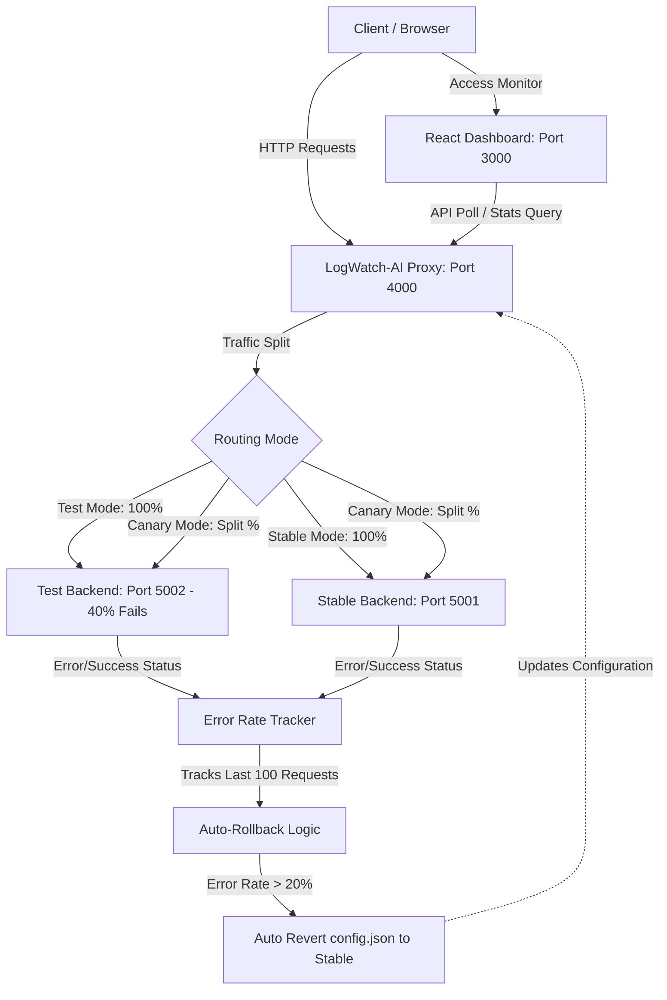

# 🔍 LogWatch-AI (AI-Powered System Reliability Platform)

[](https://gssoc.co/)
[](https://nodejs.org/)
[](https://react.dev/)
[](LICENSE)

**LogWatch-AI** is an intelligent, self-healing platform designed for real-time system reliability and safe deployments. Built with a real-time error tracking engine, automatic rollback mechanisms, and RAG-based log analysis, it protects production services from experimental release failures. The project features a premium React-based monitoring dashboard providing visual metrics, real-time log streaming, autonomous AI agent analysis, and automated self-healing visualization.

---

## 🌟 Overview

Modern distributed systems are complex and prone to failures. This platform combines:
- **Intelligent Traffic Routing**: Dynamically route between stable and test backends or split traffic with canary settings.
- **RAG-Based Log Analysis**: Explains log patterns and checks anomalies in real time.
- **Autonomous AI Agents**: Explores error causes and suggests/triggers recovery actions.
- **Self-Healing Mechanics**: Instantly rolls back config states when error thresholds are crossed, minimizing downtime.

---

## 🏗️ System Architecture & Workflow

The system is split into three main parts:
1. **LogWatch Proxy (Port 4000)**: Serves as the entrypoint. It receives all client requests, routes them based on the configuration, and performs error-rate checks.
2. **Backends (Port 5001 & 5002)**:
   - **Stable Backend**: Production-grade system with 0% simulated failure rate.
   - **Test Backend**: Canary/Staging system with 40% simulated failure rate.
3. **React Dashboard (Port 3000)**: A modern, real-time developer panel that displays metrics, streams logs, and visualizes automated rollback events.



---

## 🌟 Key Features

- **Traffic Routing Modes**: Toggle instantly between `Stable`, `Test`, and `Canary` routing modes.
- **Automated Rollback Engine**: Continuous sliding-window monitoring (last 100 requests). It automatically downgrades traffic to the stable production servers if the error rate crosses `20%`.
- **Canary Deployments**: Configure a custom canary split percentage to safely roll out experimental backend code.
- **Structured Request Logging**: Rotating log streams output with descriptive tags: `[INFO]`, `[SUCCESS]`, `[ERROR]`, and `[ALERT]`.
- **Interactive UI Dashboard**:
  - **Live Analytics**: Visual graphs representing success-to-error ratios.
  - **Log Analysis**: Search, filter, and inspect detailed request records.
  - **Workflow View**: Visual representation of current routing health.
  - **AI Analyzer Integration**: An LLM-ready component for debugging and explaining log anomalies.

---

## 📁 Repository Structure

```text
LogWatch-AI/
├── proxy/               # Traffic routing, error tracking & auto-rollback engine
│   ├── server.js        # Main proxy server
│   ├── auto-rollback.js # Automated rollback controller
│   ├── error-tracker.js # Sliding-window error percentage calculator
│   ├── enhanced-logger.js # Structured output writing
│   └── config.json      # Routing rules (Stable, Test, Canary %)
├── backend-stable/      # Stable production API backend (Port 5001)
├── backend-test/        # Experimental backend with simulated failures (Port 5002)
├── dashboard/           # React dashboard UI (Port 3000)
│   ├── src/             # React views (Home, Analytics, AI Analyzer)
│   └── public/          # Static template pages
└── README.md            # Project documentation (This file)
```

---

## 🚀 Setup & Installation

### Prerequites
- **Node.js** (v16.0.0 or higher recommended)
- **NPM** (v8.0.0 or higher)

### Install Dependencies
Navigate into each system folder to install dependencies:
```bash
# Clone the repository
git clone https://github.com/your-username/LogWatch-AI.git
cd LogWatch-AI

# Install dependencies for all components
cd proxy && npm install
cd ../backend-stable && npm install
cd ../backend-test && npm install
cd ../dashboard && npm install
```

---

## 🐳 Running with Docker (Recommended)

To run the entire system (all backends, proxy, and dashboard) with a single command:
```bash
docker-compose up --build
```
This will start all 4 services and map them to your host machine.

> [!WARNING]
> **Configuration Note for Docker:**
> Since Docker runs services in their own network, `127.0.0.1` inside the Proxy container will point to itself, not the backend containers. For local testing with Docker, you will need to change `proxy/config.json` to point to `http://backend-stable:5001` and `http://backend-test:5002` instead of `http://127.0.0.1:5001`.

---

## 💻 Running the System (Manual)

Start the services by running the start script in four separate terminals:

**Terminal 1 - Traffic Proxy Server**
```bash
cd proxy
npm start
```
*Proxy runs on [http://127.0.0.1:4000](http://127.0.0.1:4000)*

**Terminal 2 - Stable Backend**
```bash
cd backend-stable
npm start
```
*Runs on port 5001 (0% simulated failure rate)*

**Terminal 3 - Test Backend**
```bash
cd backend-test
npm start
```
*Runs on port 5002 (40% simulated failure rate)*

**Terminal 4 - React Monitoring Dashboard**
```bash
cd dashboard
npm start
```
*Runs on [http://localhost:3000](http://localhost:3000)*

---

## ⚙️ Routing Modes & Configuration

You can configure the routing mode by editing the `proxy/config.json` file or via the API:

```json
{
  "mode": "stable",
  "stable_url": "http://127.0.0.1:5001",
  "test_url": "http://127.0.0.1:5002",
  "canary_percent": 10
}
```

### Modes Breakdown:
- **`stable`**: All traffic is routed directly to the Stable Backend (port 5001).
- **`test`**: All traffic is routed directly to the Test Backend (port 5002).
- **`canary`**: Split traffic: configured percentage (e.g. 10%) goes to the Test Backend, and the remaining traffic (e.g. 90%) goes to the Stable Backend.

---

## ⚡ Automated Rollback Action

If the error rate from incoming traffic exceeds **20%** over the last 100 requests:
1. The proxy prints a `[ALERT]` warning in its terminal log.
2. The proxy switches the active configuration mode from `test` or `canary` to `stable`.
3. The `proxy/config.json` file is rewritten automatically.
4. All future client traffic is immediately directed to the Stable Backend on port 5001 to resolve errors.

> [!NOTE]
> The threshold limit can be tweaked in `proxy/server.js`:
> ```javascript
> const autoRollback = new AutoRollback(20);  // Change 20 to your preferred threshold percentage
> ```

---

## 🛠️ Testing Scenarios

Use the following terminal workflows to test self-healing behaviors:

### Test 1: Check Proxy System Status
```bash
curl http://127.0.0.1:4000/api/stats
```

### Test 2: Generate Traffic (Stable Mode)
```bash
for i in {1..5}; do
  curl http://127.0.0.1:4000/api
  sleep 0.2
done
```

### Test 3: Fetch Streaming Logs
```bash
curl http://127.0.0.1:4000/api/logs
```

### Test 4: Trigger Auto-Rollback
1. Open `proxy/config.json` and change `"mode": "stable"` to `"mode": "test"`.
2. Generate 50 consecutive traffic requests to force failing requests:
   ```bash
   for i in {1..50}; do
     curl http://127.0.0.1:4000/api 2>/dev/null
     sleep 0.1
   done
   ```
3. Watch the proxy console log for the `[ALERT]` roll back messages.
4. Verify that the configuration was rewritten automatically:
   ```bash
   curl http://127.0.0.1:4000/api/config
   ```

### Test 5: Check Rollback Event History
```bash
curl http://127.0.0.1:4000/api/rollback-history
```

---

## 📡 REST API Reference

| Method | Endpoint | Description | Payloads / Query |
| :--- | :--- | :--- | :--- |
| **GET** | `/api/stats` | Retrieve overall statistics and current error rate | N/A |
| **GET** | `/api/logs` | Fetch all requests log history | N/A |
| **GET** | `/api/config` | Read current proxy settings (`mode`, URL targets) | N/A |
| **POST** | `/api/config` | Modify routing mode configurations | `{"mode": "stable"}` |
| **GET** | `/api/health` | Check overall system health | N/A |
| **GET** | `/api/rollback-history` | List all historical self-healing events | N/A |
| **POST** | `/api/rollback` | Execute a manual rollback revert command | N/A |
| **POST** | `/api/reset-stats` | Reset accumulated success and failure counts | N/A |

---

## 🤝 Contributing

We welcome contributions from developers of all skill levels! Whether you're fixing bugs, improving documentation, or adding features — your help is appreciated 🚀

### 🆕 Adding New Features / Modules
1. Fork the repository.
2. Create a new branch:
   ```bash
   git checkout -b feature/your-feature-name
   ```
3. Implement your feature and ensure everything works as expected.
4. Commit your changes:
   ```bash
   git commit -m "Add: short description of feature"
   ```
5. Push to your fork and open a Pull Request.

### 🐛 Bug Fixes & Improvements
1. Fork the repository.
2. Create a branch:
   ```bash
   git checkout -b fix/issue-name
   ```
3. Fix the issue and test thoroughly.
4. Submit a Pull Request with a clear description.

### 🧠 AI / Log Analysis Contributions
You can contribute by improving the AI capabilities of the platform:
- Enhance RAG pipelines.
- Improve log parsing & anomaly detection.
- Optimize AI agent decision-making.
- Add new recovery or rollback strategies.

### 📝 Documentation Contributions
Good documentation is just as important as code!
- Improve README clarity.
- Add architecture explanations.
- Fix typos or formatting.
- Provide setup or deployment guides.

### 📋 Contribution Guidelines
- Follow the existing project structure.
- Write clean, readable, and modular code.
- Add comments where necessary.
- Keep commits meaningful and concise.
- Update documentation when required.

### 🧪 Testing Guidelines
Before submitting your PR, make sure:
- [ ] The project runs without errors.
- [ ] Logs and monitoring features work correctly.
- [ ] AI-based detection behaves as expected.
- [ ] Rollback/recovery triggers properly.
- [ ] No breaking changes are introduced.

---

## 🌐 Browser & Environment Compatibility

This project includes dashboards and UI components that should work across modern environments.

### ✅ Recommended Browsers
- Google Chrome
- Mozilla Firefox
- Microsoft Edge
- Safari

### 📱 Responsive Testing
Ensure your changes work across:
- **Desktop** 💻
- **Tablet** 📱
- **Mobile** 📲

*Helpful tools:* Chrome DevTools Device Toolbar, Firefox Responsive Mode.

---

## 🛠 Troubleshooting & Common Issues

Some problems may arise due to cached assets, browser-specific rendering, unsupported APIs, or extension conflicts.

### 🔍 Troubleshooting Checklist
If something doesn’t work:
- Hard refresh (Ctrl + Shift + R)
- Clear cache
- Use Incognito mode
- Disable browser extensions
- Check the browser console for errors

### 📌 Before Submitting a PR
Make sure:
- [ ] Code is tested
- [ ] UI is responsive
- [ ] Features work as intended
- [ ] No console errors
- [ ] Documentation is updated

---

## 🆘 Need Help?
If you have questions, ideas, or run into issues:
- **Discussions**: Use GitHub Discussions to ask questions or share ideas.
- **Bug Reports**: Open an Issue to report bugs or request features.
- **Direct Contact**: Kumari Lucky Raj (LinkedIn / GitHub)

## ⭐ Show Your Support
If this project helped you, please consider:
- ⭐ Starring this repository
- 🍴 Forking it to contribute
- 📢 Sharing it with others
- 💖 Following for more projects!
