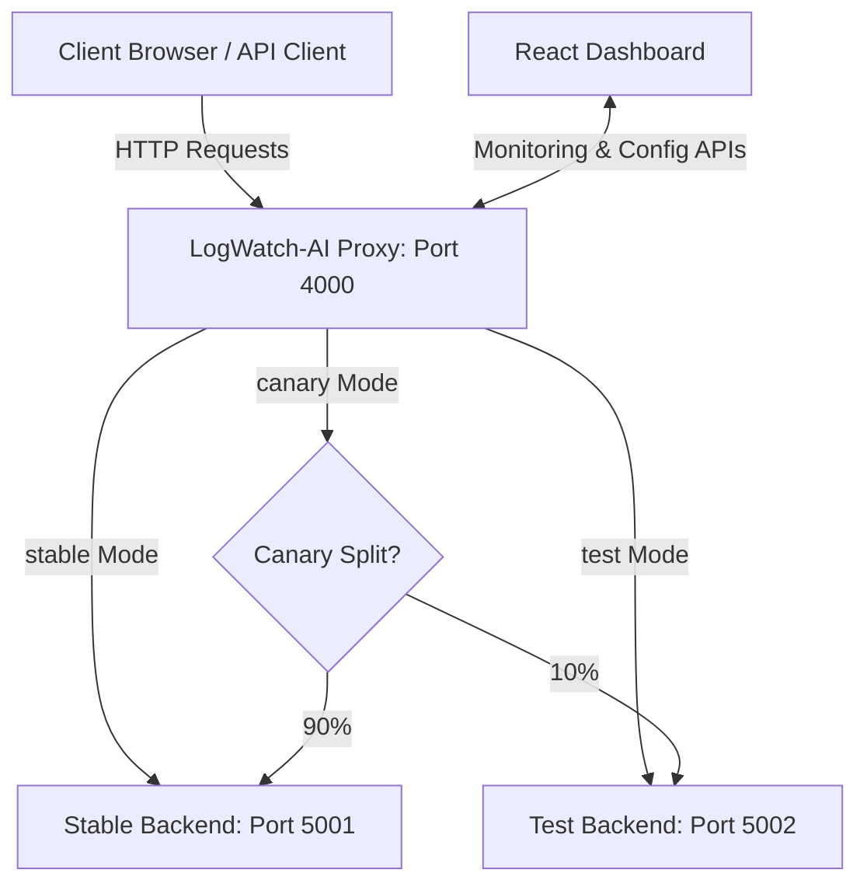

# 📊 LogWatch-AI

> A modern reverse proxy with real-time error rate tracking, automatic canary/test backend rollback, request logging, and a management dashboard.

---

## 📖 Table of Contents

- [About the Project](#about-the-project)
- [Key Features](#key-features)
- [System Architecture](#system-architecture)
- [Project Directory Structure](#project-directory-structure)
- [Getting Started & Installation](#getting-started--installation)
- [Running the Application](#running-the-application)
- [API Reference](#api-reference)
- [Traffic Routing & Modes](#traffic-routing--modes)
- [Auto-Rollback Mechanism](#auto-rollback-mechanism)
- [Testing the Setup](#testing-the-setup)
- [Contributing](#contributing)
- [License](#license)

---

## 🔍 About the Project

**LogWatch-AI** is a robust and intelligent reverse proxy and traffic routing system designed to monitor downstream microservice health. It actively tracks request success rates and dynamically routes traffic between stable and experimental/canary backend deployments. If the failure rate of the test backend exceeds a safe threshold, the proxy initiates an automatic rollback to production-stable servers, ensuring high availability and minimizing client impact.

The system consists of:
1. **Proxy Server**: The routing gateway with active telemetry.
2. **Stable Backend**: Production-ready service instance.
3. **Test Backend**: Experimental service instance with simulated failures.
4. **Dashboard**: An interactive management front-end for real-time monitoring.

---

## ✨ Key Features

- 📈 **Real-Time Error Rate Tracking**: Measures error rates dynamically over a rolling window of the last 100 requests.
- 🔄 **Automated Rollback/Failover**: Safe-guard mechanism that triggers auto-rollback to the stable version when the error rate exceeds 20%.
- 🛣️ **Flexible Traffic Modes**:
  - `stable`: 100% traffic to the stable production server.
  - `test`: 100% traffic to the experimental testing server.
  - `canary`: Configurable split routing (e.g. 90% stable, 10% test).
- 📜 **Structured Logging**: Request logs stored in JSON format with a daily rotation system.
- 🖥️ **Web Dashboard**: Modern UI interface to visualize request stats, health indicators, config, and rollback logs.

---

## 🛠️ System Architecture



---

## 📁 Project Directory Structure

```text
LogWatch-AI/
├── proxy/               # Reverse proxy core, logging, auto-rollback logic
├── backend-stable/      # Production-stable backend (0% failure rate)
├── backend-test/        # Testing/canary backend (40% simulated failure rate)
├── dashboard/           # React front-end application
├── package.json         # Root workspace configurations
└── README.md            # Project documentation
```

---

## 🚀 Getting Started & Installation

### Prerequisites

Ensure you have [Node.js](https://nodejs.org/) (v16+ recommended) and `npm` installed.

### Installation

Clone the repository and install all dependencies in each respective project directory:

```bash
# 1. Install root dependencies (if any)
npm install

# 2. Install proxy dependencies
cd proxy && npm install

# 3. Install backend dependencies
cd ../backend-stable && npm install
cd ../backend-test && npm install

# 4. Install dashboard dependencies
cd ../dashboard && npm install
```

---

## 🏃 Running the Application

To run the full suite, you need to spin up the services in separate terminal windows:

### Step 1: Start the Backend Services
```bash
# Terminal 1 - Stable Backend (Runs on Port 5001)
cd backend-stable
npm start

# Terminal 2 - Test Backend (Runs on Port 5002)
cd backend-test
npm start
```

### Step 2: Start the Proxy Server
```bash
# Terminal 3 - Proxy Server (Runs on Port 4000)
cd proxy
npm start
```

### Step 3: Start the Management Dashboard (Optional)
```bash
# Terminal 4 - React Dashboard (Runs on Port 5173 / 3000)
cd dashboard
npm start
```

---

## 📡 API Reference

All requests to the system should go through the **Proxy (Port 4000)**:

### Telemetry & Control Endpoints

| Method | Endpoint | Description |
| :--- | :--- | :--- |
| `GET` | `/api/stats` | Retrieve current error rates and performance metrics |
| `GET` | `/api/logs` | Today's structured request logs |
| `GET` | `/api/health` | Overall system health status |
| `GET` | `/api/config` | Read current active routing configuration |
| `POST` | `/api/config` | Change mode or canary weight. Body: `{"mode":"stable"}` or `{"mode":"canary","canary_percent":15}` |
| `GET` | `/api/rollback-history` | List of historical automated rollback events |
| `POST` | `/api/rollback` | Manually trigger a rollback to `stable` mode |
| `POST` | `/api/reset-stats` | Reset the error tracking statistics |

---

## ⚙️ Configuration

The proxy configuration is located in `proxy/config.json`:

```json
{
  "mode": "stable",
  "stable_url": "http://127.0.0.1:5001",
  "test_url": "http://127.0.0.1:5002",
  "canary_percent": 10
}
```

- **`mode`**: Routing configuration (must be `"stable"`, `"test"`, or `"canary"`).
- **`canary_percent`**: The percentage of traffic routed to the `test` backend when in `"canary"` mode.

---

## 🛡️ Auto-Rollback Mechanism

When the proxy is configured to route traffic to the **Test** or **Canary** modes, it continually evaluates client request results. If the percentage of errors exceeds the configured maximum threshold, it automatically updates `proxy/config.json` to revert to `stable` mode.

By default, this threshold is set to **20%** of requests within the rolling window. You can change this in `proxy/server.js`:
```javascript
// Modify the constructor argument to set a custom threshold percentage
const autoRollback = new AutoRollback(20); 
```

---

## 🧪 Testing the Setup

You can verify the proxy features using `curl` or any API client:

### 1. Check System Statistics
```bash
curl http://127.0.0.1:4000/api/stats
```

### 2. Make Batch Requests (Verify Stable Mode)
```bash
for i in {1..5}; do
  curl http://127.0.0.1:4000/api
  sleep 0.2
done
```

### 3. Trigger Auto-Rollback
1. Modify `proxy/config.json` to set `"mode": "test"`.
2. Generate 50 test requests:
   ```bash
   for i in {1..50}; do
     curl http://127.0.0.1:4000/api 2>/dev/null
     sleep 0.1
   done
   ```
3. Monitor your proxy terminal for an automated rollback message.
4. Verify that the configuration was automatically rolled back:
   ```bash
   curl http://127.0.0.1:4000/api/config
   ```

---

## 🤝 Contributing

Contributions to LogWatch-AI are welcome! Please follow these guidelines:
1. **Fork** the repository and create your feature branch.
2. Ensure your changes follow consistent formatting and style patterns.
3. Verify that all dependencies install cleanly via `npm install`.
4. Open a Pull Request with a clear explanation of your improvements.

---

## 📄 License

This project is licensed under the [MIT License](LICENSE).
