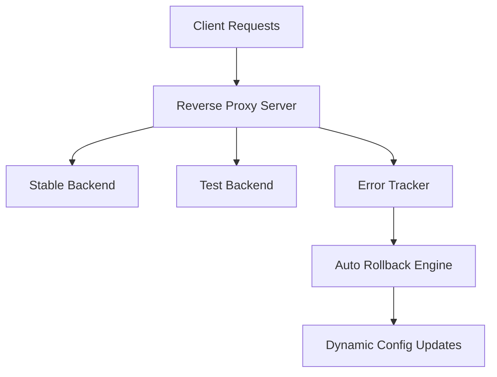

# 📊 LogWatch-AI

<p align="center">
  
</p>

---

# 🚀 About The Project

LogWatch-AI is an intelligent reverse proxy and traffic monitoring system designed to simulate modern backend reliability and failover architectures used in production-grade distributed systems.

The platform continuously monitors backend health, tracks request failure rates in real time, and automatically performs rollback operations whenever unstable services exceed safe error thresholds.

This project demonstrates important backend engineering concepts including:

- Reverse proxy architecture
- Canary deployment workflows
- Real-time telemetry and monitoring
- Automated failover systems
- Traffic routing strategies
- Backend reliability engineering
- Error tracking and recovery systems

The system dynamically routes traffic between stable and experimental backend environments while monitoring system health and automatically protecting production stability.

---

# ✨ Features

## 📈 Real-Time Monitoring

- Tracks live request statistics and error rates
- Monitors backend health continuously
- Provides real-time telemetry APIs
- Maintains rolling request metrics

---

## 🔄 Intelligent Auto-Rollback

- Automatically switches traffic back to stable backend
- Prevents extended downtime during backend failures
- Detects unhealthy backend behavior dynamically
- Supports configurable rollback thresholds

---

## 🛣️ Multiple Traffic Routing Modes

### ✅ Stable Mode
Routes 100% traffic to the stable production backend.

### 🧪 Test Mode
Routes all traffic to the experimental backend for failure simulation and testing.

### ⚡ Canary Mode
Distributes traffic between stable and test backends using configurable percentages.

---

## 📝 Request Logging

- JSON-based structured request logging
- Daily log rotation support
- Error and event tracking
- Professional log tagging system

---

## 📡 REST API Support

Provides RESTful APIs for:

- Monitoring
- Configuration management
- Rollback history
- System health tracking
- Statistics management

---

# 🧠 System Workflow



---

# 🏗️ Project Structure

```bash
LogWatch-AI/
│
├── proxy/
│   ├── server.js
│   ├── enhanced-logger.js
│   ├── error-tracker.js
│   ├── auto-rollback.js
│   └── config.json
│
├── backend-stable/
│   └── server.js
│
├── backend-test/
│   └── server.js
│
└── README.md
```

---

# ⚙️ Installation Guide

## 1️⃣ Clone The Repository

```bash
git clone <repository-url>
cd LogWatch-AI
```

---

## 2️⃣ Install Dependencies

Install dependencies inside all required folders.

### Proxy Dependencies

```bash
cd proxy
npm install
```

### Stable Backend Dependencies

```bash
cd ../backend-stable
npm install
```

### Test Backend Dependencies

```bash
cd ../backend-test
npm install
```

---

# ▶️ Running The System

Start the application using three separate terminals.

---

## 🖥️ Terminal 1 — Proxy Server

```bash
cd proxy
npm start
```

Runs on:

```bash
Port 4000
```

---

## 🖥️ Terminal 2 — Stable Backend

```bash
cd backend-stable
npm start
```

Runs on:

```bash
Port 5001
```

Stable backend maintains:

```bash
0% failure rate
```

---

## 🖥️ Terminal 3 — Test Backend

```bash
cd backend-test
npm start
```

Runs on:

```bash
Port 5002
```

Test backend simulates:

```bash
40% failure rate
```

---

# 🧪 Testing Guide

## ✅ Test 1 — Check System Statistics

```bash
curl http://127.0.0.1:4000/api/stats
```

---

## ✅ Test 2 — Send Stable Requests

```bash
for i in {1..5}; do
  curl http://127.0.0.1:4000/api
  sleep 0.2
done
```

---

## ✅ Test 3 — View Request Logs

```bash
curl http://127.0.0.1:4000/api/logs
```

---

## ✅ Test 4 — Trigger Auto Rollback

Edit:

```bash
proxy/config.json
```

Change:

```json
"mode": "stable"
```

to:

```json
"mode": "test"
```

Now send multiple requests:

```bash
for i in {1..50}; do
  curl http://127.0.0.1:4000/api 2>/dev/null
  sleep 0.1
done
```

Watch the proxy terminal for:

```bash
Auto rollback triggered
```

Verify updated configuration:

```bash
curl http://127.0.0.1:4000/api/config
```

---

## ✅ Test 5 — Check Rollback History

```bash
curl http://127.0.0.1:4000/api/rollback-history
```

---

# ⚡ Configuration

Edit:

```bash
proxy/config.json
```

Example configuration:

```json
{
  "mode": "stable",
  "stable_url": "http://127.0.0.1:5001",
  "test_url": "http://127.0.0.1:5002",
  "canary_percent": 10
}
```

---

# 🔀 Available Modes

| Mode | Description |
|------|-------------|
| Stable | Routes all traffic to stable backend |
| Test | Routes all traffic to test backend |
| Canary | Splits traffic between stable and test backend |

---

# 📡 API Endpoints

| Method | Endpoint | Description |
|--------|----------|-------------|
| GET | `/api/stats` | Current metrics and error rate |
| GET | `/api/logs` | View request logs |
| GET | `/api/config` | Current proxy configuration |
| POST | `/api/config` | Update routing mode |
| GET | `/api/health` | System health status |
| GET | `/api/rollback-history` | Rollback event history |
| POST | `/api/rollback` | Trigger manual rollback |
| POST | `/api/reset-stats` | Reset request statistics |

---

# 🛡️ Auto Rollback System

The system automatically switches traffic back to the stable backend whenever the error rate exceeds the configured threshold.

Current threshold configuration:

```js
const autoRollback = new AutoRollback(20);
```

This means rollback activates when:

```bash
Error rate > 20%
```

The threshold can be modified inside:

```bash
proxy/server.js
```

---

# 📋 Core System Files

| File | Purpose |
|------|---------|
| `proxy/server.js` | Main reverse proxy server |
| `proxy/enhanced-logger.js` | Logging system |
| `proxy/error-tracker.js` | Error tracking logic |
| `proxy/auto-rollback.js` | Rollback management |
| `proxy/config.json` | Dynamic routing configuration |
| `backend-stable/server.js` | Stable backend service |
| `backend-test/server.js` | Experimental backend service |

---

# 🧪 Learning Objectives

This project is useful for developers learning:

- Reverse proxy systems
- Load balancing concepts
- Canary deployment architecture
- Reliability engineering
- Monitoring systems
- Backend failover handling
- Traffic routing mechanisms
- Real-time telemetry systems

---

# 🛠️ Contribution Guide

Contributions are welcome.

## Steps To Contribute

1. Fork the repository
2. Create a new branch

```bash
git checkout -b feature-name
```

3. Commit your changes

```bash
git commit -m "Add your message"
```

4. Push changes

```bash
git push origin feature-name
```

5. Open a Pull Request

---

# 📈 Future Improvements

Potential future enhancements include:

- Dashboard UI for monitoring
- WebSocket-based real-time metrics
- Advanced analytics
- Kubernetes deployment support
- Docker integration
- Multi-node backend balancing
- Authentication and access control
- Distributed logging support

---

# 📜 License

This project is licensed under the MIT License.

---

# ⭐ Support

If you found this project useful:

- ⭐ Star the repository
- 🍴 Fork the repository
- 🤝 Contribute to the project

---

<p align="center">
  Made with ❤️ for learning backend reliability engineering and monitoring systems.
</p>